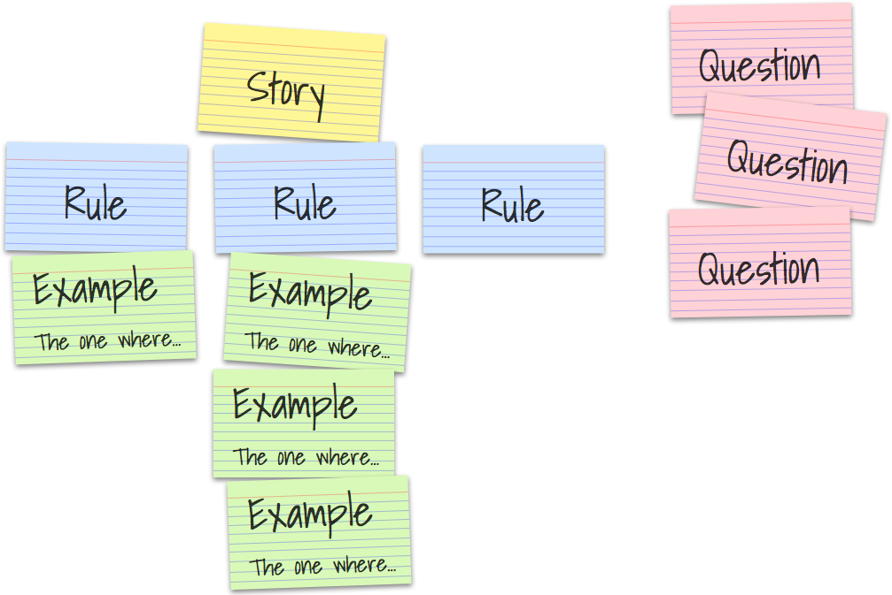

## 動機・目的
Eval の重要性がよく語られています。

- ユーザの使用データ（特に失敗例）-> EvalSetとして結晶化 -> EvalSetが通るようにプロンプト改善（既存のEvalに対してデグレも検知、両立するように）

https://www.youtube.com/watch?v=bxBzsSsqQAM

という**データフライホイールを回していく中で、「EvalSet」自体が moat**である、とまで言えるほどです。

今回は、開発の中で使うようなプロンプトに対するevalを書いてみることで、それに親しむ、直感を育んでみたいと思います。

その結果として:
- promptのevalを書き始めると、従来的コードと同様にeval容易性が高くなるように書こう、分割しよう
    -  In -> Out の型が構造的になっていないとアサーションが難しい
    -  長い散文のモノリスを解体、I/Oが明確なプロンプトに分割しないと、因子の組合せ爆発によりテスト困難
- もしかしたら、従来型コードと同じように eval容易性の高いプロンプトがおよそ良いプロンプトなのかもしれない

という**自分なりの示唆・直感**を得たので、その過程を共有したいと思います。

## 使用ツール・サンプルリポジトリ
- [promptfoo](https://www.promptfoo.dev/docs/intro/)
    - LLM-Product/機能に対する、監視・evalではなく、普段使いのプロンプトを評価してみよう、というモチベーションのため
    - ベンダーフリーのため
- https://github.com/yodakeisuke/BDD-promps-with-eval
    - BDDのプラクティスをプロンプト群に落とす、というシチュエーションを例とします

## リポジトリの解説

### 全体像：Evalピラミッドとリポジトリ構成

プロンプトの評価には複数のレベルがあります。[AI評価ピラミッド](https://www.productcompass.pm/p/ai-evals)では3層構造が提唱されています：

```
        △ Level 3: A/Bテスト（本番ユーザー行動の計測）
       ／＼
      ／  ＼ Level 2: モデル/人間評価（品質の検証）
     ／────＼
    ／        ＼ Level 1: ユニットテスト（高速フィードバック）
   ／──────────＼
```

このリポジトリでは、Level 1〜2を promptfoo で実装しています：

```
dev-prompt-eval/
├── eval/
│   ├── test-deterministic/  ← Level 1: 構造検証（高速・低コスト）
│   ├── test-qualitative/    ← Level 2: LLM-as-judge（深い品質評価）
│   └── test-integration/    ← Level 1+2 の統合テスト
├── eval-set/                ← ゴールデンデータセット
└── tunning/                 ← 評価を活用した最適化（GEPA）
```

| レイヤー | 目的    | 方法               | 速度 | 用途 |
|----------|-------|------------------|------|------|
| test-deterministic | 構造検証  | 決定論的アサーション       | 高速 | CI、高頻度実行 |
| test-qualitative | 品質評価  | LLM-as-judge     | 遅い | 定期的な深掘り |
| test-integration | 統合テスト | 両者併用、prompt結合テスト | 中 | リリース前ゲート |

厳密には
- 構造検証/品質評価 x プロンプト単体/統合 という２軸になりますが、ここでは「統合テスト」を `構造検証 & 品質評価 x 統合`のテストとしています。

### 評価対象プロンプトの概説

評価対象は BDD Example Mapping を行うプロンプト（SKILL.md）です。
プロンプトに写すのは、なんらかの「プロセス」ですので、In/Process/Out とその連鎖、と捉えるのが現実に即しています。（決定論的コードでも同じですが）

`Example Mapping`というプロセスを、
```
入力: ユーザーストーリー（フリーフォーマット、自然言語）
  ↓  プロセス（Example Mapping）
出力: ストーリー、発見したrule（実例をいつくか含む）、曖昧な点
```
と構造定義(モデリング)しました。


https://cucumber.io/blog/bdd/example-mapping-introduction/

出力スキーマ：
```json
{
  "story": { "as_a": "...", "i_want_to": "...", "so_that": "..." },
  "rules": [{ "id": "rule_1", "name": "...", "examples": [...] }],
  "questions": { "blocker": [], "clarification": [], "future": [] },
}
```

### Level 1：決定論的テスト

構造が正しいかを機械的に検証します。必須フィールドがあるか、値の型は正しいか、意図した「構造」が守られているか、決定論的にアサーションをかけます。

入力テストデータである、「ユーザストーリー」を定義しています
```yaml
# test-deterministic/promptfooconfig.yaml
tests:
  - description: "予実差異レポートの表示改善"
    vars:
      story_input: "予実差異レポートで、マイナス値を赤字で表示したい。"
    assert:
      # 構造検証：story, rules, questions が存在するか
      - type: javascript
        value: |
          const out = JSON.parse(output);
          const hasStory = out.story &&
            out.story.as_a.length > 0 &&
            out.story.i_want_to.length > 0;
          const hasRules = Array.isArray(out.rules) && out.rules.length >= 1;
          const hasQuestions = out.questions &&
            Array.isArray(out.questions.blocker);
          return hasStory && hasRules && hasQuestions;
```

// ここにLLMコールしている箇所を抜粋

決定論的テストの特徴：
- **高速**: LLM呼び出しは出力生成の1回のみ
- **低コスト**: アサーション自体は無料
- **CI向き**: コード変更のたびに実行可能

### Level 2：LLM-as-judge評価

「構造は正しいが、中身は良いのか？」を検証します。質問の深さ、ドメイン適合性、重複の有無などは人間（またはLLM）の判断が必要です。

```yaml
# test-qualitative/promptfooconfig.yaml
tests:
  - description: "曖昧な要求からの質問生成能力"
    vars:
      story_input: "予算入力画面をもっと使いやすくしたい"
    assert:
      - type: llm-rubric
        value: |
          以下の観点で評価してください（5段階）:

          1. 質問の深さと洞察力（3 Amigos視点）
             - Developer: 技術的複雑性、既存機能との整合性
             - Tester: エッジケース、エラーハンドリング
             - PO: ビジネス価値、優先度
             評価基準: 3つの視点から最低1つずつ質問を含む = 5

          2. FP&A SaaS特化性
             - 既存機能との整合性
             - 権限・承認フローへの影響
             - Excel出力への影響
             評価基準: 5つの考慮事項のうち3つ以上言及 = 5

          総合評価: 平均4.0以上でpass
```

LLM-as-judgeの特徴：
- **深い評価**: 人間の判断基準を符号化できる
- **説明付き**: なぜpassしたか・failしたかの理由が得られる
- **高コスト**: 出力生成 + 判定で2回のLLM呼び出し

### 統合テスト：ゴールデンデータセットによる検証

Level 1 + Level 2 を組み合わせ、キュレートされたテストケースで総合検証します。

```yaml
# test-integration/promptfooconfig.yaml
tests: file://../../eval-set/samples/integration-test.csv  # 9ケース

defaultTest:
  assert:
    # Level 1: 構造検証（7つの決定論的アサーション）
    - type: is-json
    - type: javascript
      value: |
        const parsed = JSON.parse(output);
        return ['story', 'rules', 'questions', 'next_actions']
          .every(key => key in parsed);
    # ... 省略 ...

    # Level 2: ドメイン適合性（LLM-as-judge）
    - type: llm-rubric
      value: |
        FP&A SaaS brownfield開発の制約を考慮しているか評価:
        - 既存機能との整合性
        - 権限・承認フローへの影響
        - Excel出力への影響
        2-3個以上の観点に言及していればpass
```

統合テストのデータセット（9ケース）：
- Job-based: 5ケース（手作業削減、精度向上、可視化、統制、協働）
- Persona-based: 4ケース（部門長、経理、CFO、IT管理者）

### 補足：評価から最適化へ

評価基準が明確になると、**自動最適化**が可能になります。

このリポジトリの `tunning/` では、GEPA（遺伝的アルゴリズム）を使ってプロンプトを最適化しています。評価メトリクスがあるからこそ、「どのプロンプトが良いか」を機械的に判定し、改善ループを回せます。

```
SKILL.md（初期プロンプト）
    ↓ GEPA最適化（tunning/）
最適化済みSKILL.md
    ↓ promptfoo評価（eval/）
品質スコア → 改善ループへ
```

Evalは単なる品質保証ではなく、**改善フライホイールの起点**です。

## 自分なりの示唆・得られた直感


## 更に...
